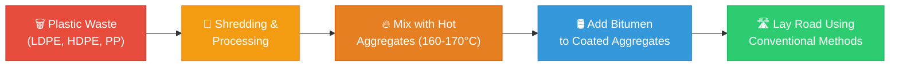
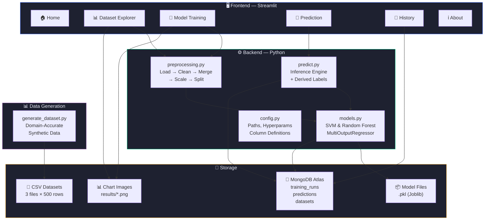
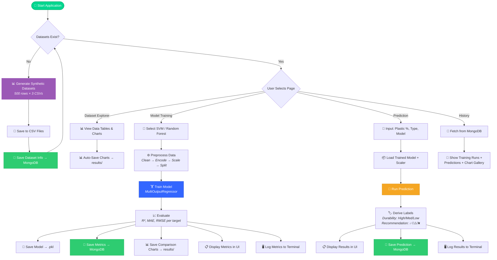
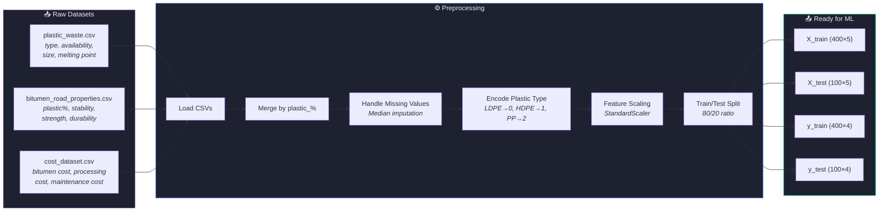
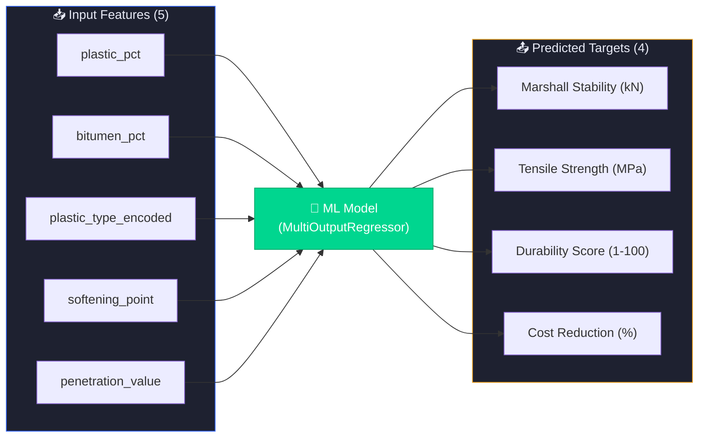
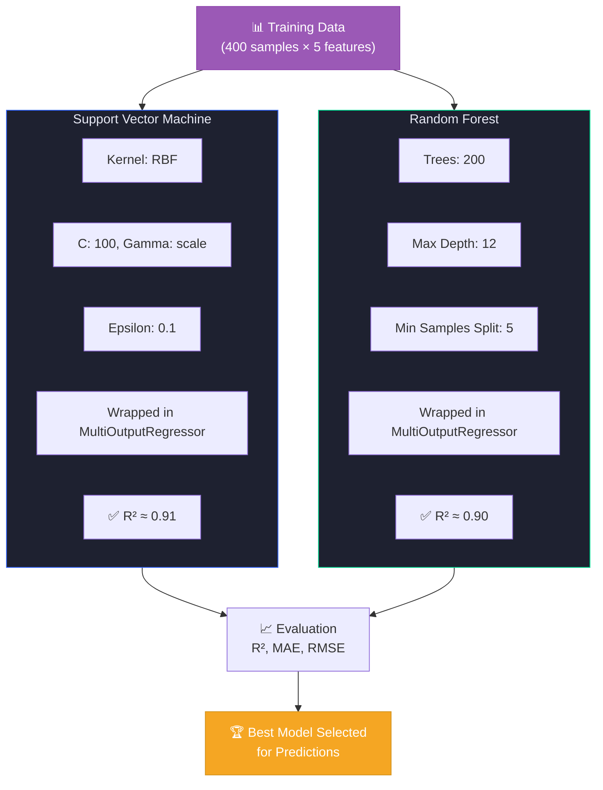
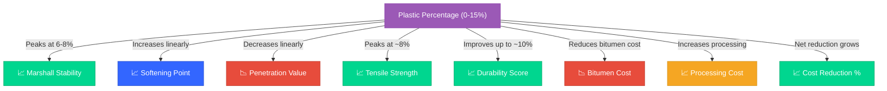
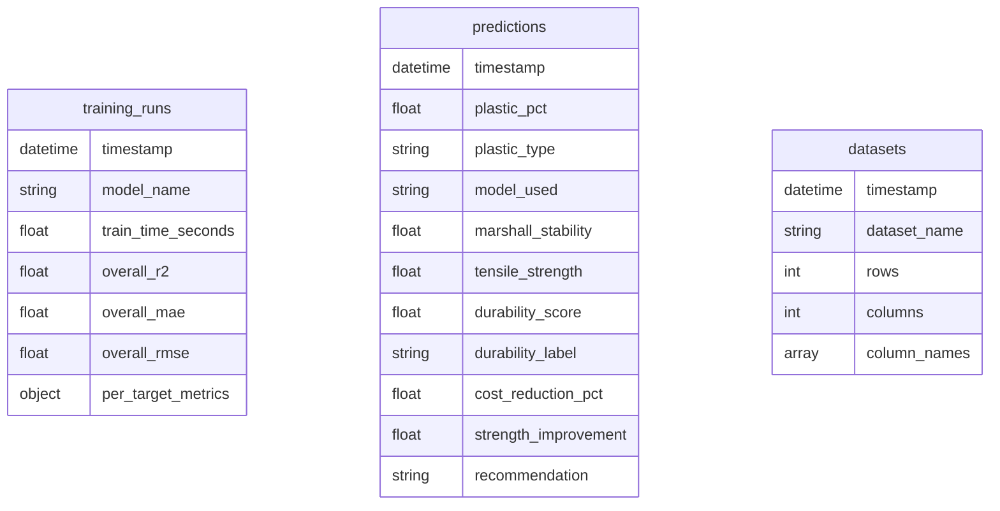

# ♻️ Waste to Wealth

**Plastic Waste Utilization in Road Construction using Machine Learning**

An ML-powered prediction system that determines the optimal percentage of plastic waste to mix with bitumen in road construction — reducing cost, improving durability, increasing strength, and promoting sustainable waste management.

---

## 🎯 What Is This Project?

Traditional road construction relies heavily on expensive bitumen. Meanwhile, plastic waste pollution is growing rapidly. This project bridges both problems by using **Machine Learning** to predict the optimal plastic-bitumen mix ratio for building durable, cost-effective, and eco-friendly roads.



### The Problem ML Solves


---

## 🚀 Features

- **ML Models** — SVM & Random Forest regressors predicting 4 road metrics simultaneously
- **Interactive UI** — Streamlit app with 6 pages: Home, Dataset Explorer, Model Training, Prediction, History, About
- **Dataset Generation** — Synthetic data with domain-accurate correlations (stability peaks at 6-8% plastic)
- **Model Comparison** — Side-by-side R², MAE, RMSE comparison charts
- **MongoDB Atlas** — All training runs and predictions persisted to cloud database
- **Chart Saving** — All generated charts auto-saved as PNG images to `results/`
- **Terminal Logging** — Every UI action mirrored to terminal with structured output
- **Premium Dark Theme** — Gradient cards, trend-line charts, hover animations

---

## 🏗️ System Architecture



---

## 🔄 Complete Workflow



---

## 📊 Data Pipeline



### Feature & Target Columns



---

## 🤖 ML Model Comparison



---

## 🔮 Prediction Flow

```mermaid
flowchart LR
    Input["👤 User Input<br/>Plastic: 6%<br/>Type: LDPE<br/>Model: RF"] 
    --> Scale["⚖️ Scale Features<br/>(StandardScaler)"]
    --> Model["🤖 Loaded Model<br/>(.pkl file)"]
    --> Raw["📊 Raw Predictions<br/>stability, strength,<br/>durability, cost"]
    --> Labels["🏷️ Derive Labels"]
    --> Output["📋 Final Output"]

    subgraph OutputDetails["Example Output"]
        O1["Stability: 11.95 kN"]
        O2["Strength: 3.28 MPa (+64%)"]
        O3["Durability: High (75)"]
        O4["Cost Reduction: 17.5%"]
        O5["✅ Highly Recommended"]
    end

    Output --> OutputDetails

    style Input fill:#3366ff,stroke:#2952cc,color:#fff
    style Model fill:#00d68f,stroke:#00a86b,color:#fff
    style Output fill:#f5a623,stroke:#d4941e,color:#fff
    style OutputDetails fill:#1e2130,stroke:#00d68f,color:#e8eaf6
```



---

## 📊 Domain Relationships

These are the key domain rules encoded in the synthetic dataset:



---

## 📊 Predicted Metrics

| Metric                   | Description                    |
| ------------------------ | ------------------------------ |
| Marshall Stability (kN)  | Road strength indicator        |
| Tensile Strength (MPa)   | Load bearing capacity          |
| Durability Score (1-100) | Expected lifespan              |
| Cost Reduction (%)       | Savings vs traditional bitumen |

---

## 🧪 Suitable Plastic Types

| Type | Source                     | Melting Point |
| ---- | -------------------------- | ------------- |
| LDPE | Carry bags, packaging film | 105-115°C     |
| HDPE | Milk covers, bottles       | 120-135°C     |
| PP   | Food wrappers, containers  | 130-170°C     |

> ⚠️ **PVC is NOT suitable** due to toxic emissions when heated.

---

## 🛠️ Technology Stack

| Layer               | Technologies                                |
| ------------------- | ------------------------------------------- |
| **Backend**         | Python, Pandas, NumPy, Scikit-learn         |
| **Frontend**        | Streamlit (dark theme UI)                   |
| **Database**        | MongoDB Atlas                               |
| **ML Models**       | SVM (RBF kernel), Random Forest (200 trees) |
| **Serialization**   | Joblib (.pkl)                               |

---

## 📁 Project Structure

```
W-To-W/
├── app.py                          # Streamlit UI (6 pages)
├── requirements.txt                # Python dependencies
├── .streamlit/
│   └── config.toml                 # Streamlit theme config
├── data/
│   ├── generate_dataset.py         # Synthetic data generator
│   ├── plastic_waste.csv           # 500 rows
│   ├── bitumen_road_properties.csv # 500 rows
│   └── cost_dataset.csv            # 500 rows
├── models/                         # Saved .pkl model files
│   ├── svm_model.pkl
│   ├── rf_model.pkl
│   └── scaler.pkl
├── results/                        # Auto-saved chart images (PNG)
└── src/
    ├── __init__.py
    ├── config.py                   # Paths, hyperparams, columns
    ├── database.py                 # MongoDB Atlas connection & CRUD
    ├── preprocessing.py            # Load → clean → merge → scale → split
    ├── models.py                   # Train & evaluate SVM / Random Forest
    └── predict.py                  # Inference with derived labels
```

---

## ⚡ Quick Start

```bash
# 1. Clone the repository
git clone https://github.com/PDReddyDhanu/Waste-To-Wealth.git
cd Waste-To-Wealth

# 2. Install dependencies
pip install -r requirements.txt

# 3. Generate datasets
python data/generate_dataset.py

# 4. Run the app
python -m streamlit run app.py
```

---

## 🖥️ App Pages

### 🏠 Home

Project overview with benefit cards and a one-click dataset generation button.

### 📊 Dataset Explorer

Three tabs (Plastic Waste, Bitumen Properties, Cost Analysis) with interactive dataframes, summary metrics, and auto-generated trend-line charts.

### 🤖 Model Training

Select SVM and/or Random Forest → Train → View per-target R², MAE, RMSE metrics and side-by-side comparison bar charts. Results are saved to MongoDB and charts to `results/`.

### 🔮 Prediction

Slider for plastic %, dropdown for plastic type, model selector → Get instant predictions for durability, strength, cost reduction, and a recommendation label. Results are persisted to MongoDB.

### 📜 History

Database-backed history page showing all past training runs, all past predictions, and a gallery of saved chart images — all pulled from MongoDB Atlas.

### ℹ️ About

Plastic types info, the dry-mix process, ML model descriptions, and technology stack.

---

## 📈 Model Performance

| Model         | Overall R² | Status                |
| ------------- | ---------- | --------------------- |
| SVM (RBF)     | ~0.91      | ✅ Exceeds 85% target |
| Random Forest | ~0.90      | ✅ Exceeds 85% target |

---

## 🗄️ MongoDB Collections



---

## 📜 License

This project is for academic and research purposes.
